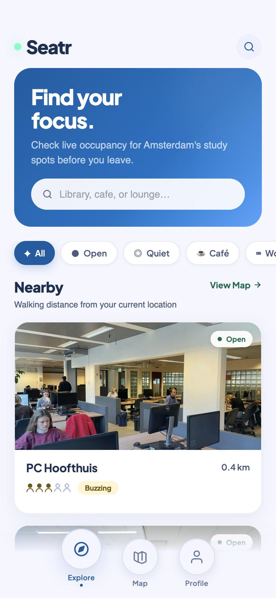
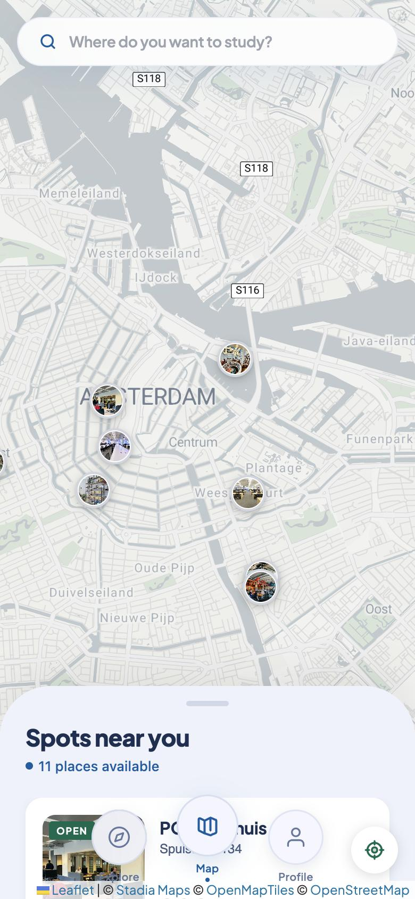
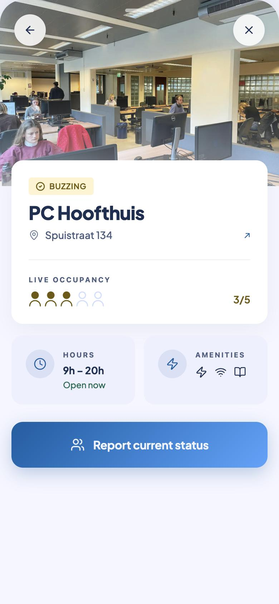
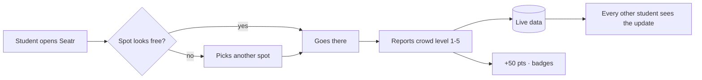
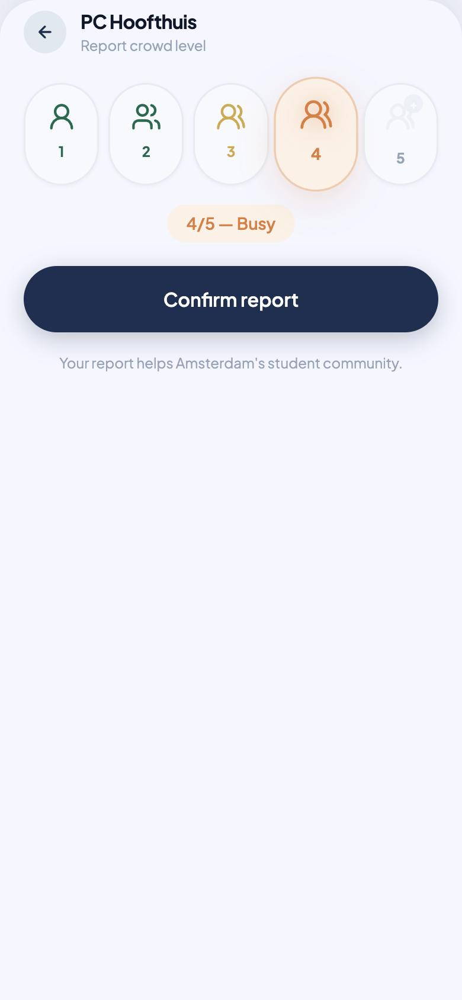
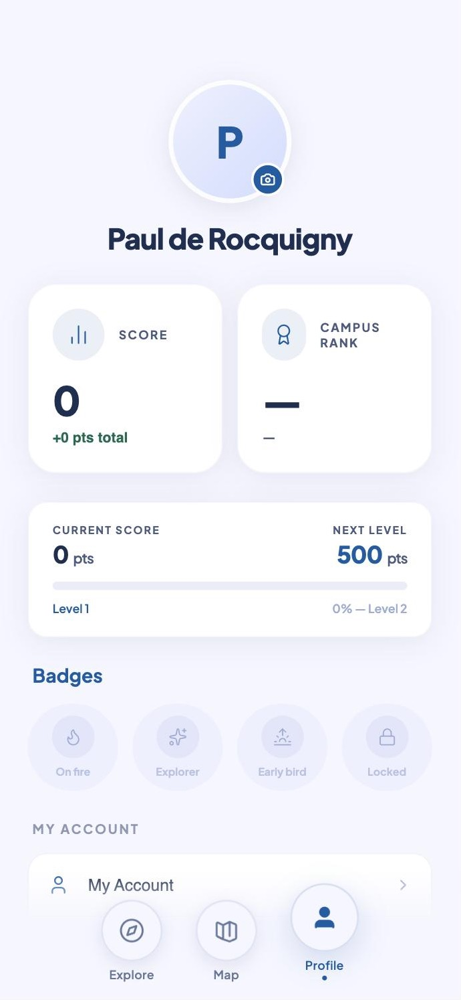

<div align="center">

# 🟢 Seatr

### Know if there's a seat **before** you leave home.

Seatr is a mobile web app that shows Amsterdam students which study spots (libraries, university study halls, cafés) are open and how full they are **right now**. The live crowd levels come from students themselves.


&nbsp;

&nbsp;


</div>

---

## The problem: too many students, too few seats

Amsterdam has more than **124,000 university and HBO students** ([Gemeente Amsterdam, Onderwijs in cijfers 2025](https://onderzoek.amsterdam.nl/artikel/onderwijs-in-cijfers-2025)), and there aren't nearly enough places for them to study.

| | |
|---|---|
| 🎓 **43,147** students enrolled at the UvA in 2025 | [UvA, Nov 2025](https://www.uva.nl/content/nieuws/nieuwsberichten/2025/11/uva-telt-dit-jaar-iets-minder-studenten.html) |
| 🪑 **4,800** study places across *all* UvA locations | [Folia, Jan 2026](https://www.folia.nl/nl/actueel/170960/wie-in-de-ub-wil-studeren-moet-voor-dag-en-dauw-op-zoek-naar-een-plek) |
| ➗ So roughly **1 seat for every 9 students** | |
| ⏰ Students say you need to arrive **before 9 a.m.** to be sure of a seat at the University Library | [Folia, Jan 2026](https://www.folia.nl/nl/actueel/170960/wie-in-de-ub-wil-studeren-moet-voor-dag-en-dauw-op-zoek-naar-een-plek) |
| 🧥 In some study halls **more than half the chairs** are "reserved" with a jacket | [Folia, Jan 2026](https://www.folia.nl/nl/actueel/170960/wie-in-de-ub-wil-studeren-moet-voor-dag-en-dauw-op-zoek-naar-een-plek) |
| 📅 During exam periods the UvA has to open buildings like the Bushuis at weekends to absorb the overflow | [Folia](https://www.folia.nl/nl/actueel/173855/uva-opent-bushuis-in-weekenden-tijdens-tentamenperiode-vanwege-drukte-ub) |

The housing crisis makes this worse: **studying at home often isn't an option**. Half of Amsterdam students in shared housing have a room **smaller than 14 m²**, and the city has been thousands of student rooms short for years ([ASVA / Kences Local Monitor Student Housing 2021](https://asva.nl/en/interests/student-housing/student-housing-in-numbers/)). A tiny room with a bed and no desk pushes students out to the library. When everyone does that at once, the library is full.

The result is a daily routine many Amsterdam students know well:

> Bike 20 minutes to the UB → it's full → try Roeterseiland → full → try a café → full, or €5 a coffee to stay → give up and go home.

Universities do publish occupancy for some of *their own* buildings. But a student wants to know where the **nearest free seat in the whole city** is, whether that's a uni library, the OBA public library or a café with Wi-Fi.

## The solution

Seatr puts every study spot in Amsterdam on **one map** with a **live crowd level**, kept up to date by the students who are already there.

1. **Check before you go.** Open the app and see which spots are open and how busy each one is (1 = empty → 5 = full).
2. **Go where there's room.** Filter by *Open*, *Quiet*, *Café*, *Library* or *Workspace*, or browse the map.
3. **Report when you arrive.** Two taps tell everyone else how full it is right now.
4. **Get rewarded.** Each report earns **+50 points**, which count towards levels and badges on your profile.

Every student who reports saves the next student a wasted trip. The more people use it, the more accurate it gets.



---

## Screenshots

| Login | Explore | Spot detail |
|:---:|:---:|:---:|
|  |  |  |
| Email or Google sign-in | Search, filters and nearby spots with live crowd levels | Opening hours, amenities, live occupancy |

| Report crowd level | Map | Profile |
|:---:|:---:|:---:|
|  |  |  |
| Rate the crowd from 1 (empty) to 5 (full) | Every spot in the city at a glance | Score, level progress and badges |

<sub>All screenshots come from the running app: real spots, photos and opening hours from the Airtable database, and a real logged-in account on the profile screen.</sub>

---

## Features

- 🗺️ **Live map** of Amsterdam study spots (Leaflet + Stadia Maps), with a "locate me" button
- 👥 **Crowd level 1-5** for every spot, reported by students, plus a "last updated" time so old reports don't mislead
- 🟢 **Open / closed badge** worked out from each spot's opening hours, including places open past midnight
- 🔎 **Search and filters**: open now, quiet, café, library, workspace
- 📱 **Bottom-sheet detail view** you can swipe to full screen, with address (opens in Google Maps), hours, amenities and highlights
- 🏆 **Gamification**: +50 points per report, levels, badges and a campus rank, updated live via Supabase Realtime
- 🔐 **Accounts**: email/password or Google sign-in (Supabase Auth)
- 🌍 **English and French**
- 🔄 **Auto-refresh** every 2 minutes; a report shows up on your screen instantly, before the server even answers
- 🧪 **Demo mode**: without API keys the app runs on built-in sample data, so anyone can try it

## Tech stack

| Layer | Tech |
|---|---|
| Frontend | React 18, Vite 5, Tailwind CSS 3, framer-motion, lucide-react |
| Map | Leaflet / react-leaflet, Stadia Maps "Alidade Smooth" tiles |
| Spot data | Airtable (`StudySpots` table) |
| Auth and scores | Supabase (Auth, `profiles` table, Realtime, `get_my_rank` RPC) |

```
src/
├── App.jsx                 # app shell, spot detail sheet, report flow
├── components/
│   ├── Auth.jsx            # login / sign-up screen
│   ├── BottomNav.jsx       # floating 3-circle navigation
│   ├── SplashScreen.jsx
│   └── tabs/               # ExploreTab, MapTab, ProfileTab
├── context/                # AuthContext, UserContext (score), LanguageContext
├── hooks/useStudySpots.js  # loading, auto-refresh, reporting
├── services/airtable.js    # Airtable read / update
├── lib/supabase.js
├── i18n/                   # EN / FR strings
└── utils/time.js           # open-now logic
```

## Getting started

```bash
git clone https://github.com/paulderock/StudySpots.git
cd StudySpots
npm install
npm run dev          # → http://localhost:5173
```

Without a `.env` file the app shows the login screen and runs on demo data. To connect real data, copy `.env.example` to `.env` and fill in:

```bash
VITE_AIRTABLE_TOKEN=pat...           # Airtable personal access token
VITE_AIRTABLE_BASE_ID=app...         # Airtable base containing the StudySpots table
VITE_SUPABASE_URL=https://xxx.supabase.co
VITE_SUPABASE_ANON_KEY=...
```

The Airtable `StudySpots` table has these columns: `Name`, `Type`, `Address`, `OpeningTime`, `ClosingTime`, `Vibe`, `Highlight`, `Image`, `Lat`, `Lng`, `CurrentOccupancy` (1-5), `LastUpdated`.

## Roadmap

- [ ] Move Airtable writes behind a server function, so the API token never ships to the browser
- [ ] Add points on the server (Supabase RPC), so scores can't be faked or lost when two reports land at the same time
- [ ] Average several recent reports per spot instead of keeping only the latest one
- [ ] Predict "usually busy at this hour" from past reports
- [ ] Bring in official occupancy feeds where universities offer them
- [ ] Expand beyond Amsterdam (Utrecht, Rotterdam, Leiden…)

---

<div align="center">
Built in Amsterdam, for students who just want somewhere to sit. 📚
</div>
